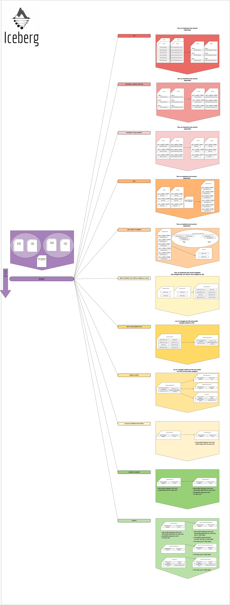

<div id="top"></div>

<!-- PROJECT SHIELDS -->
<!--
*** I'm using markdown "reference style" links for readability.
*** Reference links are enclosed in brackets [ ] instead of parentheses ( ).
*** See the bottom of this document for the declaration of the reference variables
*** for contributors-url, forks-url, etc. This is an optional, concise syntax you may use.
*** https://www.markdownguide.org/basic-syntax/#reference-style-links
-->

<!--
[![Contributors][contributors-shield]][contributors-url]
[![Forks][forks-shield]][forks-url]
[![Stargazers][stars-shield]][stars-url]
[![Issues][issues-shield]][issues-url]
[![MIT License][license-shield]][license-url]
[![LinkedIn][linkedin-shield]][linkedin-url]
-->


<!-- PROJECT LOGO -->
<br />
<div align="center">
  <a href="https://github.com/github_username/repo_name">
    
  </a>

<h3 align="center">ICEBERG PROJECT</h3>

  <p align="center">
    Tool for analyzing and visualizing GUIDEseq experiments to Humans.
    <br />
    <a href="https://github.com/github_username/repo_name"><strong>Explore the docs »</strong></a>
    <br />
    <br />
    <a href="https://github.com/github_username/repo_name">View Demo</a>
    ·
    <a href="https://github.com/github_username/repo_name/issues">Report Bug</a>
    ·
    <a href="https://github.com/github_username/repo_name/issues">Request Feature</a>
  </p>
</div>


<!-- TABLE OF CONTENTS -->
<details>
  <summary>Table of Contents</summary>
  <ol>
    <li><a href="#about-the-project">About The Project</a></li>
    <li><a href="#project-diagram">Project Diagram</a></li>
    <li><a href="#built-with">Built With</a></li>
    <li>
      <a href="#getting-started">Getting Started</a>
      <ul>
        <li><a href="#prerequisites">Prerequisites</a></li>
        <li><a href="#installation">Installation</a></li>
        <li><a href="#tests">Tests</a></li>
      </ul>
    </li>
    <li>
        <a href="#usage">Usage</a>
        <ul>
            <li><a href="#prerequisites">Command Line</a></li>
            <li><a href="#input">Input</a></li>
            <li><a href="#output">Output</a></li>
        </ul>
    </li>
    <li><a href="#roadmap">Roadmap</a></li>
    <li><a href="#contributing">Contributing</a></li>
    <li><a href="#license">License</a></li>
    <li><a href="#contact">Contact</a></li>
    <li><a href="#acknowledgments">Acknowledgments</a></li>
  </ol>
</details>


<!-- ABOUT THE PROJECT -->
## About The Project

[![Product Name Screen Shot][product-screenshot]](https://example.com) <br>
<p>
The purpose of the Iceberg package is to preform our analysis by steps to the well-known GUIDE-Seq experiments.
It takes as input a yaml file (input_file.yaml) which contains the paths to raw sequencing reads files (FASTQ) of
treatment and control experiments along with other parameters and it identifies different genomic sites types:
</p>
<ol>
<li>CRISPR activity sites: On/Off targets.</li>
<li>Spontaneous break sites: Spontaneous DNA breaks (which appear also in the control experiment).</li>
<li>Noise sites: Sites with low number of reads in comparison to the control experiment sites <br> 
(where sites are grouped to bins by their reads MAPQ and comparison done on each bin separately).</li>
</ol>
<p>
The package generate report (iceberg-report.html) that contains over view on the iceberg pipeline and 
links to three reports - one for each site type, where each one contains all the corresponding sites. 
Each site is visualized with IGV and other complementary visualization components controlled by a sites table which
contains complementary analyzed information. 
To avoid retyping too much info. Do a search and replace with your text editor for the following: `github_username`, `repo_name`, `twitter_handle`, `linkedin_username`, `email`, `email_client`, `project_title`, `project_description`
</p>

<p align="right">(<a href="#top">back to top</a>)</p>


## Project Diagram
<div align="center">
  <a href="https://github.com/github_username/repo_name">
    
  </a>
</div>

<p align="right">(<a href="#top">back to top</a>)</p>

## Built With

* [Next.js](https://nextjs.org/)
* [React.js](https://reactjs.org/)

<p align="right">(<a href="#top">back to top</a>)</p>


<!-- GETTING STARTED -->
## Getting Started

Follow the next steps for getting started with Iceberg.

### Prerequisites

This is an example of how to list things you need to use the software and how to install them.
* BWA  
  ```
  Link for download: https://sourceforge.net/projects/bio-bwa/files/
  Version: 0.7.17
  Verfy that your installation is in the $PATH or consider add to YAML
  ```
* SAMTOOLS
  ```
  Link for download: https://sourceforge.net/projects/samtools/files/samtools/1.11/
  Version: samtools-1.11.tar.bz2
  Verfy that your installation is in the $PATH
  ```

### Installation
1. Clone the repository into an empty directory.
   ```
   git clone https://github.com/ilaigenish/iceberg.git
   ```
2. Create and activate virtualenv.
    ```
    python3 -m venv env
    source env/bin/activate
    ```

3. Install requirements.txt file.
   ```
   cd iceberg
   pip install -r requirements.txt
   ```

### Tests
We recommend you to run the test before you continue.
```
 python -m unittest test/test_iceberg.py
```

<p align="right">(<a href="#top">back to top</a>)</p>


<!-- USAGE EXAMPLES -->
## Usage

### Running Command..

```
python iceberg/analyzer.py --input_file_path absolute/path/to/input.yaml
```

### Input
The input.yaml file contains the following arguments:<br>
- `OUTPUT_FOLDER_PATH`: Absolute path to folder that will contain the iceberg output.

- `ANALYZER STEPS`: The steps that will execute.
    - `UMI`: [Step Documentation](docs/UMI.md)
    - `EXPERIMENT_LIBRARIES_DETECTION`: [Step Documentation](docs/EXPERIMENT_LIBRARIES_DETECTION.md)
    - `EXPERIMENT_TRACES_REMOVAL`: [Step Documentation](docs/EXPERIMENT_TRACES_REMOVAL.md)
    - `BWA`: [Step Documentation](docs/BWA.md)
    - `UNITE_READS_TO_ICEBERGS`: [Step Documentation](docs/UNITE_READS_TO_ICEBERGS.md)
    - `MERGE_TREATMENT_AND_CONTROL_ICEBERGS_BY_LOCUS`: [Step Documentation](docs/MERGE_TREATMENT_AND_CONTROL_ICEBERGS_BY_LOCUS.md)
    - `UNITE_CLOSE_ICEBERGS_SITES`: [Step Documentation](docs/UNITE_CLOSE_ICEBERGS_SITES.md)
    - `CALCULATE_ICEBERGS_SITES_PROFILE`: [Step Documentation](docs/CALCULATE_ICEBERGS_SITES_PROFILE.md)
    - `BREAKS_CLASSIFY`: [Step Documentation](docs/BREAKS_CLASSIFY.md)
    - `GUIDERNA_ALIGNMENT`: [Step Documentation](docs/GUIDERNA_ALIGNMENT.md)
    - `REPORTS`: [Step Documentation](docs/REPORTS.md)

- `EXPERIMENTS`:
  - `EXPERIMENTS_FOLDER_PATH`: Absolute path to folder that contain the experiments fastq files (8 files).
  - `REFERENCE_GENOME_PATH`: Absolute path to genome reference file.
  - `EXPERIMENTS_TAG`: The tag that was injected at the cut events during the GUIDEseq experiment.

    - `TX`:
         - `NAME`: Name for the experiment, use to name files during the pipeline.
         - `R1`: Treatment R1 fastq file name.
         - `R2`: Treatment R2 fastq file name.
         - `I1`: Treatment I1 fastq file name. 
         - `I2`: Treatment I2 fastq file name.
         - `GUIDERNA`: The GuideRNA used in the GUIDEseq experiment.
    - `CONTROL`:
        - `NAME`: Name for the experiment, use to name files during the pipeline.
         - `R1`: Control R1 fastq file name. 
         - `R2`: Control R2 fastq file name.
         - `I1`: Control I1 fastq file name. 
         - `I2`: Control I2 fastq file name.


- `HYPERPARAMATERS`:
    - `UMI_BPS_AMOUNT_FROM_READS_START`: For each paired-end reads and their indexes - r1, r2, i1,i2 from an experiment  R1, R2, I1, I2 fastqs, 
       Unique Molecular Index (UMI) is assigned to both r1 and r2 by <br> i2\[8:16]_r1\[0:umi_bps_amount_from_reads_start]_r2\[0:umi_bps_amount_from_reads_start]
    - `MIN_QUALITY`: The minimum quality of a read for it to be considered in the consolidation process at the UMI step.
    - `MIN_FREQUENCY`: The minimum frequency of a read for the position to be consolidated in the consolidation process at the UMI step.

    - `MAX_READS_DISTANCE`: The maximum distance allowed between read and iceberg (in nts) for the read to be joined to the iceberg.
    - `MAX_ICEBERG_DISTANCE`: The maximum distance allowed between two icebergs-sites (in nts) for the icebergs sites to be joined.
    - `MAX_ALIGNMENTS_HAMMING_DISTANCE`: The maximum Hamming distance allowed between two sequences alignment to be valid.
    - `NOISE_BINS_AND_CONTROL_MAPQ_PERCENTILE`: Lists of bins for the noise sites filtering. Where 
        <br> bin defined as: \[\[bin-min-icebergs-mapq, bin-max-icebergs-mapq), bin-icebergs-control-percentile] 
        Example : \[\[\[0, 1], 0.99],\[\[1, 50] 0.99],\[\[50, 61] 0.95]]
    - `CRISPR_ACTIVITY_THRESHOLD`: Used for classify the icebergs sites in to CRISPR activities and Spontanues Break Sites, see BREAKS_CLASSIFY step for more information.

### Outputs

Here we will explain about the iceberg outputs.


For more Information, please refer to the [Documentation](https://example.com)

<p align="right">(<a href="#top">back to top</a>)</p>


<!-- ROADMAP -->
## Roadmap

- [] Feature 1
- [] Feature 2
- [] Feature 3
    - [] Nested Feature

See the [open issues](https://github.com/github_username/repo_name/issues) for a full list of proposed features (and known issues).

<p align="right">(<a href="#top">back to top</a>)</p>


<!-- CONTRIBUTING -->
## Contributing

Contributions are what make the open source community such an amazing place to learn, inspire, and create. Any contributions you make are **greatly appreciated**.

If you have a suggestion that would make this better, please fork the repo and create a pull request. You can also simply open an issue with the tag "enhancement".
Don't forget to give the project a star! Thanks again!

1. Fork the Project
2. Create your Feature Branch (`git checkout -b feature/AmazingFeature`)
3. Commit your Changes (`git commit -m 'Add some AmazingFeature'`)
4. Push to the Branch (`git push origin feature/AmazingFeature`)
5. Open a Pull Request

<p align="right">(<a href="#top">back to top</a>)</p>


<!-- LICENSE -->
## License

Distributed under the MIT License. See `LICENSE.txt` for more information.

<p align="right">(<a href="#top">back to top</a>)</p>


<!-- CONTACT -->
## Contact

Your Name - [@twitter_handle](https://twitter.com/twitter_handle) - email@email_client.com

Project Link: [https://github.com/github_username/repo_name](https://github.com/github_username/repo_name)

<p align="right">(<a href="#top">back to top</a>)</p>


<!-- ACKNOWLEDGMENTS -->
## Acknowledgments

* []()
* []()
* []()

<p align="right">(<a href="#top">back to top</a>)</p>


<!-- MARKDOWN LINKS & IMAGES -->
<!-- https://www.markdownguide.org/basic-syntax/#reference-style-links -->
[contributors-shield]: https://img.shields.io/github/contributors/github_username/repo_name.svg?style=for-the-badge
[contributors-url]: https://github.com/github_username/repo_name/graphs/contributors
[forks-shield]: https://img.shields.io/github/forks/github_username/repo_name.svg?style=for-the-badge
[forks-url]: https://github.com/github_username/repo_name/network/members
[stars-shield]: https://img.shields.io/github/stars/github_username/repo_name.svg?style=for-the-badge
[stars-url]: https://github.com/github_username/repo_name/stargazers
[issues-shield]: https://img.shields.io/github/issues/github_username/repo_name.svg?style=for-the-badge
[issues-url]: https://github.com/github_username/repo_name/issues
[license-shield]: https://img.shields.io/github/license/github_username/repo_name.svg?style=for-the-badge
[license-url]: https://github.com/github_username/repo_name/blob/master/LICENSE.txt
[linkedin-shield]: https://img.shields.io/badge/-LinkedIn-black.svg?style=for-the-badge&logo=linkedin&colorB=555
[linkedin-url]: https://linkedin.com/in/linkedin_username
[product-screenshot]: images/screenshot.png